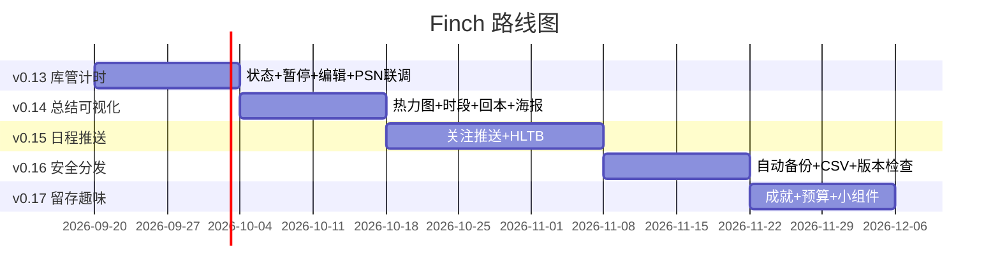

# Finch 路线图

基线：`v0.15.5`（DB v15，versionCode 59）。
IGDB 已整体移除（国内直连不通）；HLTB 已写回（详情直抓+Bangumi联动，免配置）。
下阶段主题：**让数据更安全 → 让留存更有趣**。

## 规划原则

1. **本地优先**：所有新功能零服务器，推送/备份/统计全走本地 + WorkManager。
2. **一次只升一个 DB 版本**：每个功能版最多一次 `MIGRATION_X_Y`，`app/schemas/` 必须入库，备份校验共用 `FINCH_DB_VERSION`。
3. **功能版与重构版交替**：参考 0.12.1/0.12.2 节奏，大 UI 改动后跟一个清理版。
4. **每个版本可独立发版**：按 `versionName` 打 tag 即能发 Release，不互相卡脖子。

## 总览

| 版本 | 主题 | 核心内容 | DB | 依赖新增 |
|------|------|----------|----|----------|
| v0.13 ✅已交付 | 库管与计时可信 | 游戏状态＋主页筛选；计时暂停/继续；会话可编辑 | 8→9 | 无 |
| v0.14 ✅已交付 | 总结可视化 | 热力图；作息（周几/几点）；战报分享 v1（回本率已移除） | 9→10→11 | 无 |
| v0.15 ✅已交付 | 日程变有用 | 发售关注＋推送；通关进度条（手动）；WorkManager 基建 | 11→12 | `work-runtime-ktx` |
| v0.15.1–0.15.3 ❌已移除 | 资料库换源 | TGDB→IGDB、HLTB 自动获取（国内直连不通，整体回滚） | 12→13 | 无 |
| v0.15.4 ✅已交付 | 移除 | IGDB/HLTB 代码与 DB 列全删，搜索链退回 Bangumi→Steam | 13→14 | 无 |
| v0.15.5 ✅已交付 | HLTB 写回 | 详情直抓+Bangumi联动（免配置）；点开自动获取三围 | 14→15 | 无 |
| v0.14 | 总结可视化 | 年度热力图；时段分布（周几/几点）；元/小时回本率；月度战报海报 v1 | 9→10 | 无（加 `share` 用系统 API） |
| v0.15 | 日程变有用 | 发售关注＋发售前推送；通关进度条（HLTB 参考）；WorkManager 基建 | 10→11 | `androidx.work:work-runtime-ktx` |
| v0.16 | 数据安全与分发 | 自动备份；CSV 导出；私有分发＋应用内版本检查 | 11（不变） | 无（复用 WorkManager） |
| v0.17 | 留存与趣味 | 成就/连击徽章；游玩预算提醒；小组件扩展 | 11（不变，徽章纯算） | 无 |
| 远期 / 明确不做 | — | WebDAV 同步（可选）；前台自动识别、账号云同步、国际化明确不做 | — | — |

---

## v0.13 —— 库管与计时可信（DB 8→9）✅ 已交付（v0.13.0）

**为什么先做**：计时是记账的命，不准后面全错；backlog 管不住库会越堆越乱。两者都是纯本地、无联调。

- **游戏状态**：`Game.status: 想玩 / 在玩 / 搁置 / 通关 / 全成就`（与旧 `completed` 布尔双写兼容）✅
- **主页筛选排序**：状态＋收藏＋平台 FilterChip，排序四档 ✅
- **计时暂停/继续**：`ACTION_PAUSE / ACTION_RESUME` + 通知按钮 + 恢复路径 + 小组件 ✅
- **会话可编辑**：记录页/详情页起止编辑 ✅
- **PSN 真机联调**：仍待实测（需提供 npsso token），延后到有真机条件时联调，不 blocking 后续版本。

原计划明细（已实现，展开查看）

- **游戏状态**：`Game.status: 想玩 / 在玩 / 搁置 / 通关 / 全成就`（替代散装的 `completed` 布尔，`completed` 保留做兼容，勾选通关自动同步 status）。
  主页加一排 FilterChip（状态＋收藏＋平台）＋排序（最近玩 / 总时长 / 评分）。
  改动：`data/Game.kt`、`data/FinchDatabase.kt(MIGRATION_8_9)`、`ui/HomeScreen.kt`、`ui/FinchViewModel.kt`。
- **计时暂停/继续**：`TimerService` 加 `ACTION_PAUSE / ACTION_RESUME`，通知加暂停按钮；`play_sessions` 加 `pauseAccumMs + pauseStartedAt`（暂停段不计入时长，走秒= now - start - pauseAccum）。
  注意同步改 `restoreOrStop()` 恢复路径和 `FinchWidgetSync`。
  改动：`timer/TimerService.kt`、`timer/TimerNotifications.kt`、`data/PlaySession.kt`。
- **会话可编辑**：记录页/详情页长按会话 → 改起止时间（`sessionDao().update()`），带“结束必须晚于开始”校验。无 schema 变更。
- **验收**：暂停 10 分钟只记 1 分钟；杀进程恢复暂停态不错；状态筛选+排序可用；`schemas/9.json` 入库。
- **工作量**：M（约 1.5–2 周，暂停是风险点）。

## v0.14 —— 总结可视化（DB 9→10→11）✅ 已交付（v0.14.1）

**为什么**：`StatsScreen.kt` 已有 `dailyTotals/topGames`，全是现成数据做展示，零联调、传播最强。

- **热力图** ✅：月视图按周对齐，年视图 12 月横滑
- **作息** ✅：周几条形（周一开头）+ 24 小时高峰柱
- **回本率** ❌已移除（v0.14.1：详情页价格卡 + `SteamStoreClient.fetchPrice` + `FinchViewModel.fetchPriceOnce` + 价格单测全删；DB 11 重建 games 表去掉价格列）
- **战报分享 v1** ✅：文本版走系统分享（图片模板延到 v0.17）

原计划明细（已实现，展开查看）

- **年度热力图**：GitHub 式 365 格（月视图 30 格），复用 `observeDailyTotals`，峰值高亮。不新增 DAO。
  改动：`ui/StatsScreen.kt` 新 `HeatmapCard`。
- **时段分布**：`SessionDao` 加两个聚合查询——按周几（`strftime('%w')`）、按小时（`strftime('%H')`）分组求和，画两排条形。
  改动：`data/FinchDaos.kt`（只加查询，不改表，**DB 版本不变也行**，但为省事可并入 v10）。
- **元/小时回本率**：`games` 加 `priceCny REAL + priceFetchedAt INTEGER`（MIGRATION_9_10），Steam 游戏从 `SteamStoreClient`（`appdetails` 价格接口）拉一次存下来；详情页显示“68 元玩了 120h，0.6 元/h，已回本 ✓”。
  改动：`data/Game.kt`、`data/SteamStoreClient.kt`、`ui/GameDetailScreen.kt`。
  （❌ v0.14.1 已移除；DB 11 去掉价格列）
- **月度战报海报 v1**：把现有 `HeroTotalCard + MonthReportCard + TopGames` 拼成一张 Bitmap，长按分享（系统 ShareSheet）。先做静态拼图，动画/模板放到 v0.17。
- **验收**：热力图与柱状图数字与 Hero 总时长对得上；无价格游戏不显示回本行；海报在浅/深主题下都不糊。
- **工作量**：M（约 2 周）。

## v0.15 —— 日程变有用（DB 11→12）✅ 已交付（v0.15.0）

**为什么**：日程页从“看”到“用”。WorkManager 在此版一次性引入，v0.16 自动备份直接复用。

- **发售关注＋推送** ✅：`release_follows` 表（MIGRATION_11_12），日程行 ☆/★ + 顶部置顶卡，Worker 每天检查发售前 3 天推送
- **通关进度条** ✅：`games.hltbMainMin`（并入 11→12），手动填参考时长（清空隐藏）；HLTB 在线抓取降级为手动，可用性优先
- **WorkManager 基建** ✅：`work-runtime-ktx:2.10.4`，`FinchApp.onCreate` 调度（KEEP）

原计划明细（已实现，展开查看）

- **WorkManager 基建**：加 `androidx.work:work-runtime-ktx`，先做一个 `DailyCheckWorker` 空壳（每天跑一次，打 log），为关注推送和自动备份铺路。注意 Doze/省电白名单提示文案。
- **发售关注＋推送**：新表 `release_follows(name/coverUrl/date/source/notifyDays)`（MIGRATION_10_11 建表），日程页每行加“☆关注”，3 天内发售发本地通知，点通知进详情/入库。
  改动：`ui/UpcomingScreen.kt`、`ui/UpcomingViewModel.kt`、新 `data/ReleaseFollow.kt + Worker`。
- **通关进度条（HLTB 参考）**：`games` 加 `hltbMainMin INTEGER`（并入 10→11 迁移），数据源先用 Bangumi 条目信息/手动填，HLTB 抓取做成可降级（抓不到就隐藏进度条，不报错）。详情页显示“已玩 Xh / 主线 Yh（Z%）”。
- **验收**：关注 3 天后的游戏能收到通知（杀进程后仍能）；无 HLTB 数据时详情页无变化；WorkManager 在小米/三星上不过度耗电。
- **工作量**：L（约 3 周，推送联调是风险点）。

## v0.16 —— 数据安全与分发（DB 不变）

**为什么**：数据多了以后备份就是命；同时把 README 里“私有分发”遗留项 closes 掉。纯工程版，无 DB 变更，可与 v0.15 并行开发。

- **自动备份**：`SettingsStore` 加 `autoBackupEnabled + lastBackupAt`，复用 `BackupManager.export()` + WorkManager 每周跑一次写到应用私有目录，保留最近 4 份。导入页显示“上次自动备份时间”。
  改动：`data/BackupManager.kt`（加 `autoBackup()`）、`data/SettingsStore.kt`、新 `AutoBackupWorker`。
- **CSV 导出**：`sessions.csv`（日期/游戏/平台/起止/时长/来源），用现有 DAO 数据拼，方便丢 Excel/B站动态 pro 分析。
- **私有分发＋应用内版本检查**：GitHub Releases 页 + `VersionCheckWorker`（每周查一次 `releases/latest`，有新版弹 Snackbar/通知，点开浏览器下载）。版本号以 `versionName` 为准。
- **验收**：卸载重装后从自动备份恢复分毫不差；CSV 用 Excel 打开不乱码；飞行模式下版本检查静默跳过。
- **工作量**：S–M（约 2 周）。

## v0.17 —— 留存与趣味（DB 不变）

**为什么**：放在最后——徽章/预算都依赖前面统计算得准，否则会算错被骂。

- **成就/连击徽章**：纯算（不建表）：连续 7 天、月度全勤、年度 1000h、单作 100h、通关 10 作。总结页加一排徽章墙，已解锁高亮。
- **游玩预算提醒**：`SettingsStore` 加 `weeklyBudgetMin`，超预算发本地通知“本周已玩 22h，超预算 10%”。周一 0 点清零（WorkManager 复用）。
- **小组件扩展**：现有 `FinchWidget` 加周累计 + 月 Top1，点击直达对应详情页。
- **战报海报 v2（可选）**：多模板/深色模板，v0.14 反馈好才做，否则砍。
- **验收**：徽章条件在设置页可查；预算提醒可一键关；小组件不增加耗电（沿用整分推送节奏）。
- **工作量**：M（约 2 周）。

---

## DB 演进一览

| DB | 版本 | 变更 |
|----|------|------|
| 8 | v0.12.2（旧基线） | `favorite/completed/completedAt/rating/thoughts` |
| 9 | v0.13.x（已交付） | `games.status + statusUpdatedAt`（已通关回填 COMPLETED）；`play_sessions.pauseAccumMs + pauseStartedAt` |
| 10 | v0.14.0（过渡） | `games.priceCny + priceFetchedAt`（回本率引入；v0.14.1 移除，仅作迁移垫脚） |
| 11 | v0.14.x（已交付） | 重建 games 表去掉价格列（与 v9 表结构一致） |
| 12 | v0.15.0（已交付） | 新表 `release_follows`；`games.hltbMainMin` |
| 13 | v0.15.1–0.15.3（过渡，已移除） | `games.hltbExtraMin + hltb100Min + igdbId`（IGDB/HLTB 引入；v0.15.4 移除，仅作迁移垫脚） |
| 14 | v0.15.4（过渡） | 重建 games 表去掉 IGDB/HLTB 列（与 v12 表结构一致） |
| 15 | v0.15.5（现状） | 加回 `games.hltbExtraMin + hltb100Min`（HLTB 写回，Bangumi 联动免配置） |
| 10 | v0.14 | `games.priceCny + priceFetchedAt` |
| 11 | v0.15 | 新表 `release_follows`；`games.hltbMainMin` |
| 11 | v0.16 / v0.17 | 不变（设置项走 `SettingsStore`，徽章纯算） |

备份恢复逻辑（`BackupManager.validate()`）按 `FINCH_DB_VERSION` 校验，跨版恢复走 Room 自动迁移，老备份可读。

## 明确不做

- 启动自动同步（README 已定，不改）。
- 账号体系＋云同步（成本爆炸；WebDAV 可列为远期可选，优先级低于上面全部）。
- 前台应用自动识别在玩什么（`UsageStats` 权限重、耗电、易被差评）。
- 国际化（README 已定，不做）。

## 建议的动手顺序

1. **v0.13 ✅ 已交付**：状态＋暂停＋编辑，一版让“记”可信。
2. **v0.14 ✅ 已交付**：热力图＋作息＋战报分享 v1，让“看”值得分享。
3. **v0.15 ✅ 已交付**：发售关注＋推送、通关进度条，WorkManager 基建一次到位。
4. v0.16 跟上：自动备份＋CSV＋版本检查（复用 WorkManager），纯工程版。
4. v0.17 收尾：徽章＋预算，把留存拉起来。
