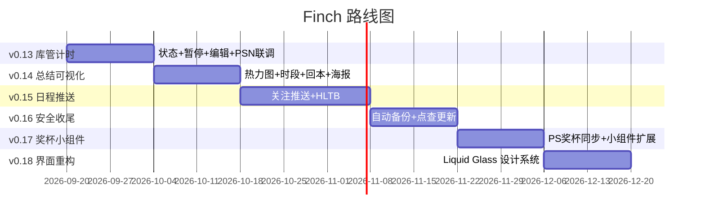

# Finch 路线图

基线：`v0.18.0`（DB v17，versionCode 77）。
IGDB 已整体移除（国内直连不通）；HLTB 改走 Crashdummy 中转 API（Steam 直查+Nlib 英文名+按名搜，默认开、可一键关）；非英文库名走英文名解析链换英文线索再搜（Steam 中文反查/Bangumi 原名/eShop 英文段/游民星空/机翻已移除，v0.15.15–0.15.18）。
下阶段主题：**让记录更细 → 让表达更强**（v0.19 候选，见文末）。

## 规划原则

1. **本地优先**：所有新功能零服务器，推送/备份/统计全走本地 + WorkManager。
2. **一次只升一个 DB 版本**：每个功能版最多一次 `MIGRATION_X_Y`，`app/schemas/` 必须入库，备份校验共用 `FINCH_DB_VERSION`。
3. **功能版与重构版交替**：参考 0.12.1/0.12.2 节奏，大 UI 改动后跟一个清理版。
4. **每个版本可独立发版**：按 `versionName` 打 tag 即能发 Release，不互相卡脖子。

## 总览

| 版本 | 主题 | 核心内容 | DB | 依赖新增 |
|------|------|----------|----|----------|
| v0.13 ✅已交付 | 库管与计时可信 | 游戏状态＋主页筛选；计时暂停/继续；会话可编辑 | 8→9 | 无 |
| v0.14 ✅已交付 | 总结可视化 | 热力图；作息（周几/几点）；战报分享 v1（回本率已移除） | 9→10→11 | 无 |
| v0.15 ✅已交付 | 日程变有用 | 发售关注＋推送；通关进度条（手动）；WorkManager 基建 | 11→12 | `work-runtime-ktx` |
| v0.15.1–0.15.3 ❌已移除 | 资料库换源 | TGDB→IGDB、HLTB 自动获取（国内直连不通，整体回滚） | 12→13 | 无 |
| v0.15.4 ✅已交付 | 移除 | IGDB/HLTB 代码与 DB 列全删，搜索链退回 Bangumi→Steam | 13→14 | 无 |
| v0.15.5 ✅已交付 | HLTB 写回 | 详情直抓+Bangumi联动（免配置）；点开自动获取三围 | 14→15 | 无 |
| v0.15.6 ✅已交付 | HLTB 中转 | 改走 Crashdummy 中转 API（Steam 直查+按名搜+开关，默认开） | 15（不变） | 无 |
| v0.15.7 ✅已交付 | 体验修复 | Switch 按名搜多关键词轮询；通关勾选联动进度封顶 | 15（不变） | 无 |
| v0.15.8 ✅已交付 | 体验修复 | Switch 搜不到根因修：eShop 英文名联动（中文库名→英文段→中转） | 15（不变） | 无 |
| v0.15.9 ✅已交付 | 体验修复 | Switch 真根因修：Moon 语言头发 en-GB，库名回英文（HLTB 按名搜才可能命中） | 15（不变） | 无 |
| v0.15.10 ✅已交付 | 体验修复 | 中文库名跳过直搜（必 404），失败文案列实际关键词 | 15（不变） | 无 |
| v0.15.11 ✅已交付 | 体验修复 | eShop 只取拉丁英文段（日文词不再污染查询）；删 Bangumi 兜底；无英文词直说文案 | 15（不变） | 无 |
| v0.15.12 ✅已交付 | 体验修复 | Switch TitleID→英文名联动（Nlib 免配置，命中写回库名） | 15（不变） | 无 |
| v0.16 ✅已交付 | 数据安全收尾 | 自动备份＋恢复入口；点按钮检查更新（不轮询）；CSV 不做（zip 导出已覆盖） | 16（不变） | 无（复用 WorkManager） |
| v0.17 ✅已交付 | 奖杯与小组件 | PS 奖杯同步（详情页奖杯卡＋总结页汇总）；小组件扩展 | 16→17 | 无 |
| v0.18 ✅已交付 | 界面重构 | Liquid Glass 设计系统＋统一玻璃层级＋逐屏重做；玻璃性能修复；构建提速 | 17（不变） | 无 |
| v0.18.1 ✅热修 | 奖杯同步修正 | 实测 trophyTitles 无 npTitleId → 改 `/titles/trophyTitles` 按 psnTitleId 批量映射（每批≤5） | 17（不变） | 无 |
| 远期 / 明确不做 | — | WebDAV 同步（可选）；前台自动识别、账号云同步、国际化明确不做 | — | — |

```mermaid
gantt
    title Finch 路线图
    dateFormat  YYYY-MM-DD
    section v0.13 库管计时
    状态+暂停+编辑+PSN联调       :a1, 2026-09-20, 14d
    section v0.14 总结可视化
    热力图+时段+回本+海报        :a2, after a1, 14d
    section v0.15 日程推送
    关注推送+HLTB               :a3, after a2, 21d
    section v0.16 安全收尾
    自动备份+点查更新           :a4, after a3, 14d
    section v0.17 奖杯小组件
    PS奖杯同步+小组件扩展        :a5, after a4, 14d
    section v0.18 界面重构
    Liquid Glass 设计系统        :a6, after a5, 14d
```

---

## v0.13 —— 库管与计时可信（DB 8→9）✅ 已交付（v0.13.0）

**为什么先做**：计时是记账的命，不准后面全错；backlog 管不住库会越堆越乱。两者都是纯本地、无联调。

- **游戏状态**：`Game.status: 想玩 / 在玩 / 搁置 / 通关 / 全成就`（与旧 `completed` 布尔双写兼容）✅
- **主页筛选排序**：状态＋收藏＋平台 FilterChip，排序四档 ✅
- **计时暂停/继续**：`ACTION_PAUSE / ACTION_RESUME` + 通知按钮 + 恢复路径 + 小组件 ✅
- **会话可编辑**：记录页/详情页起止编辑 ✅
- **PSN 真机联调**：仍待实测（需提供 npsso token），延后到有真机条件时联调，不 blocking 后续版本。

原计划明细（已实现，展开查看）

- **游戏状态**：`Game.status: 想玩 / 在玩 / 搁置 / 通关 / 全成就`（替代散装的 `completed` 布尔，`completed` 保留做兼容，勾选通关自动同步 status）。
  主页加一排 FilterChip（状态＋收藏＋平台）＋排序（最近玩 / 总时长 / 评分）。
  改动：`data/Game.kt`、`data/FinchDatabase.kt(MIGRATION_8_9)`、`ui/HomeScreen.kt`、`ui/FinchViewModel.kt`。
- **计时暂停/继续**：`TimerService` 加 `ACTION_PAUSE / ACTION_RESUME`，通知加暂停按钮；`play_sessions` 加 `pauseAccumMs + pauseStartedAt`（暂停段不计入时长，走秒= now - start - pauseAccum）。
  注意同步改 `restoreOrStop()` 恢复路径和 `FinchWidgetSync`。
  改动：`timer/TimerService.kt`、`timer/TimerNotifications.kt`、`data/PlaySession.kt`。
- **会话可编辑**：记录页/详情页长按会话 → 改起止时间（`sessionDao().update()`），带“结束必须晚于开始”校验。无 schema 变更。
- **验收**：暂停 10 分钟只记 1 分钟；杀进程恢复暂停态不错；状态筛选+排序可用；`schemas/9.json` 入库。
- **工作量**：M（约 1.5–2 周，暂停是风险点）。

## v0.14 —— 总结可视化（DB 9→10→11）✅ 已交付（v0.14.1）

**为什么**：`StatsScreen.kt` 已有 `dailyTotals/topGames`，全是现成数据做展示，零联调、传播最强。

- **热力图** ✅：月视图按周对齐，年视图 12 月横滑
- **作息** ✅：周几条形（周一开头）+ 24 小时高峰柱
- **回本率** ❌已移除（v0.14.1：详情页价格卡 + `SteamStoreClient.fetchPrice` + `FinchViewModel.fetchPriceOnce` + 价格单测全删；DB 11 重建 games 表去掉价格列）
- **战报分享 v1** ✅：文本版走系统分享（图片模板延到 v0.17）

原计划明细（已实现，展开查看）

- **年度热力图**：GitHub 式 365 格（月视图 30 格），复用 `observeDailyTotals`，峰值高亮。不新增 DAO。
  改动：`ui/StatsScreen.kt` 新 `HeatmapCard`。
- **时段分布**：`SessionDao` 加两个聚合查询——按周几（`strftime('%w')`）、按小时（`strftime('%H')`）分组求和，画两排条形。
  改动：`data/FinchDaos.kt`（只加查询，不改表，**DB 版本不变也行**，但为省事可并入 v10）。
- **元/小时回本率**：`games` 加 `priceCny REAL + priceFetchedAt INTEGER`（MIGRATION_9_10），Steam 游戏从 `SteamStoreClient`（`appdetails` 价格接口）拉一次存下来；详情页显示“68 元玩了 120h，0.6 元/h，已回本 ✓”。
  改动：`data/Game.kt`、`data/SteamStoreClient.kt`、`ui/GameDetailScreen.kt`。
  （❌ v0.14.1 已移除；DB 11 去掉价格列）
- **月度战报海报 v1**：把现有 `HeroTotalCard + MonthReportCard + TopGames` 拼成一张 Bitmap，长按分享（系统 ShareSheet）。先做静态拼图，动画/模板放到 v0.17。
- **验收**：热力图与柱状图数字与 Hero 总时长对得上；无价格游戏不显示回本行；海报在浅/深主题下都不糊。
- **工作量**：M（约 2 周）。

## v0.15 —— 日程变有用（DB 11→12）✅ 已交付（v0.15.0）

**为什么**：日程页从“看”到“用”。WorkManager 在此版一次性引入，v0.16 自动备份直接复用。

- **发售关注＋推送** ✅：`release_follows` 表（MIGRATION_11_12），日程行 ☆/★ + 顶部置顶卡，Worker 每天检查发售前 3 天推送
- **通关进度条** ✅：`games.hltbMainMin`（并入 11→12），手动填参考时长（清空隐藏）；HLTB 在线抓取降级为手动，可用性优先
- **WorkManager 基建** ✅：`work-runtime-ktx:2.10.4`，`FinchApp.onCreate` 调度（KEEP）

原计划明细（已实现，展开查看）

- **WorkManager 基建**：加 `androidx.work:work-runtime-ktx`，先做一个 `DailyCheckWorker` 空壳（每天跑一次，打 log），为关注推送和自动备份铺路。注意 Doze/省电白名单提示文案。
- **发售关注＋推送**：新表 `release_follows(name/coverUrl/date/source/notifyDays)`（MIGRATION_10_11 建表），日程页每行加“☆关注”，3 天内发售发本地通知，点通知进详情/入库。
  改动：`ui/UpcomingScreen.kt`、`ui/UpcomingViewModel.kt`、新 `data/ReleaseFollow.kt + Worker`。
- **通关进度条（HLTB 参考）**：`games` 加 `hltbMainMin INTEGER`（并入 10→11 迁移），数据源先用 Bangumi 条目信息/手动填，HLTB 抓取做成可降级（抓不到就隐藏进度条，不报错）。详情页显示“已玩 Xh / 主线 Yh（Z%）”。
- **验收**：关注 3 天后的游戏能收到通知（杀进程后仍能）；无 HLTB 数据时详情页无变化；WorkManager 在小米/三星上不过度耗电。
- **工作量**：L（约 3 周，推送联调是风险点）。

## v0.16 —— 数据安全收尾（DB 不变）✅ 已交付（v0.16.0）

**为什么**：数据多了以后备份就是命。纯工程版，无 DB 变更。
**范围修订（2026-10-08 拍板）**：导出已有「导出备份」zip 覆盖需求，**CSV 不做**；版本检查改**点按钮才查**，不做每周后台轮询。

- **自动备份**：`SettingsStore` 加 `autoBackupEnabled + lastAutoBackupAt`，新 `AutoBackupWorker`（WorkManager 每周跑）调 `BackupManager.autoBackup()` 写应用私有目录、保留最近 4 份（失败半截 zip 即删）；导入页「备份与恢复」卡显示「上次自动备份时间」、开关、可从最近自动备份恢复（带确认弹窗）。
  改动：`data/BackupManager.kt`、`data/SettingsStore.kt`、新 `data/AutoBackupWorker.kt`、`ui/ImportViewModel.kt`、`ui/ImportScreen.kt`。
- **点查更新**：导入页新增「版本与更新」卡，点「检查更新」才 GET 一次 GitHub `releases/latest`（不后台轮询、不上传任何数据），有新版列出版本号并「去下载」跳浏览器；比对口径 `UpdateChecker.isNewerVersion`（逐段数字比较）。
  改动：新 `data/UpdateChecker.kt`、`ui/ImportViewModel.kt`、`ui/ImportScreen.kt`。
- ~~**CSV 导出**~~：不做——「导出备份」zip 已覆盖导出需求。
- **验收**：自动备份开启后落盘、只留最近 4 份、可一键恢复并重启应用；飞行模式下点检查更新只报网络失败、不崩；版本号逐段比较（0.15.9 < 0.15.20）。
- **注意**：自动备份在应用私有目录，**卸载即清**——换机/重装前走「导出备份」存外部（文案已提示）。
- **工作量**：S。

## v0.17 —— 奖杯与小组件（DB 16→17）✅ 已交付（v0.17.0）

**范围修订（2026-10-08 拍板）**：~~成就/连击徽章~~、~~游玩预算提醒~~ 都不做，换成 **PS 奖杯同步**；小组件扩展保留。
**为什么**：PSN 同步通道（npsso→OAuth→accountId）已就绪，奖杯概要接口与 gamelist **同域同 token**（`m.np.playstation.com/api/trophy/v1/users/{accountId}/trophyTitles`，一次分页最多 800 条，per-game 白金/金/银/铜＋进度＋最近获奖时间），边际成本低、对 PS 玩家感知强。

- **PS 奖杯同步（DB 16→17）**：`games` 加奖杯列（`trophyPlatinum/Gold/Silver/Bronze + trophyProgress + trophyUpdatedAt`，MIGRATION_16_17）；PSN 同步顺带拉奖杯概要，按名字归认到库内游戏（沿用同步的匹配口径，宁漏勿错）。
  - 详情页加奖杯卡（白金/金/银/铜 + 进度条）；总结页加奖杯汇总（总白金数等 + 奖杯等级，`getUserTrophyProfileSummary`）
  - 改动：`data/PsnClient.kt`（trophyTitles 分页 + 概要解析）、`data/SyncEngine.kt`、`data/Game.kt` + `FinchDatabase.kt`（迁移与 schema 17）、`ui/GameDetailScreen.kt`、`ui/StatsScreen.kt`
- **小组件扩展**：现有 `FinchWidget` 加周累计 + 月 Top1，点击直达对应详情页（沿用整分推送节奏不加耗电）。
- **~~成就/连击徽章~~ / ~~游玩预算提醒~~**：不做（用户拍板）。
- **战报海报 v2（可选）**：多模板/深色模板，v0.14 反馈好才做，否则砍。
- **验收**：PSN 同步后库内 PS 游戏带奖杯四围与进度、非 PS 游戏无变化；`schemas/17.json` 入库、老库升级数据不丢；奖杯接口解析有单测（口径入 JsonParseTest）；小组件不增加耗电。
- **风险**：奖杯接口形态以实测为准（与 Nlib/游民同规矩，文档仅参考）；接口若要逐游戏细查会超请求预算——只拉概要级数据，不逐奖杯展开。
- **实测修正（2026-10-26，v0.18.1）**：`trophyTitles` 概要接口实测**不含 npTitleId**（0/8），PS 行名字兜底又遇「合集 vs 单作重制」对不上 → v0.17.0 线上实际未写入任何奖杯；改为 `/trophy/v1/users/me/titles/trophyTitles?npTitleIds=`（每批 ≤5，实测 6 个报 400）按 `games.psnTitleId` 精确归认，多奖杯集四围求和、完成度按已获得/总数折算。
- **工作量**：M（约 2 周，PSN 接口实测是风险点）。

## v0.19 —— 记录粒度（DB 17→18，候选待拍板）

**为什么**：现在一条会话只有时长，「主线/联机/多周目」分不开，是记录粒度的最后一块短板；图片海报是 v0.14 文本战报欠下的自然延伸。

- **会话标签/备注**：`play_sessions` 加 `tag TEXT`（MIGRATION_17_18，主线/支线/联机/多周目/自定义）；记录页/详情页按标签筛选，统计页出标签分布
- **时长目标**：`SettingsStore` 加年度/月度目标，总结页进度环（纯配置无 DB）
- **战报图片海报 v1**：Hero 卡＋热力图＋Top1 拼 Bitmap 走 ShareSheet（静态拼图）
- **验收**：标签升级迁移老会话不丢；`schemas/18.json` 入库；海报深浅主题都不糊
- **工作量**：M（约 2 周）

---

## DB 演进一览

| DB | 版本 | 变更 |
|----|------|------|
| 8 | v0.12.2（旧基线） | `favorite/completed/completedAt/rating/thoughts` |
| 9 | v0.13.x（已交付） | `games.status + statusUpdatedAt`（已通关回填 COMPLETED）；`play_sessions.pauseAccumMs + pauseStartedAt` |
| 10 | v0.14.0（过渡） | `games.priceCny + priceFetchedAt`（回本率引入；v0.14.1 移除，仅作迁移垫脚） |
| 11 | v0.14.x（已交付） | 重建 games 表去掉价格列（与 v9 表结构一致） |
| 12 | v0.15.0（已交付） | 新表 `release_follows`；`games.hltbMainMin` |
| 13 | v0.15.1–0.15.3（过渡，已移除） | `games.hltbExtraMin + hltb100Min + igdbId`（IGDB/HLTB 引入；v0.15.4 移除，仅作迁移垫脚） |
| 14 | v0.15.4（过渡） | 重建 games 表去掉 IGDB/HLTB 列（与 v12 表结构一致） |
| 15 | v0.15.5–0.15.12（已交付） | 加回 `games.hltbExtraMin + hltb100Min`（HLTB 写回；v0.15.6 改走中转 API，DB 不变） |
| 16 | v0.15.13+（已交付） | 重建 `play_sessions` 统一 `pauseAccumMs` DDL（实体补 `defaultValue="0"`，升级装/新装一致） |
| 17 | v0.17.0（已交付） | `games` 加奖杯 6 列（`trophyPlatinum/Gold/Silver/Bronze/Progress/UpdatedAt`）；`MIGRATION_12_13` 补建 `index_release_follows_key`（v12 新装库升级崩溃修复） |

备份恢复逻辑（`BackupManager.validate()`）按 `FINCH_DB_VERSION` 校验，跨版恢复走 Room 自动迁移，老备份可读。

## 明确不做

- 启动自动同步（README 已定，不改）。
- 账号体系＋云同步（成本爆炸；WebDAV 可列为远期可选，优先级低于上面全部）。
- 前台应用自动识别在玩什么（`UsageStats` 权限重、耗电、易被差评）。
- 国际化（README 已定，不做）。

## 建议的动手顺序

1. **v0.13 ✅ 已交付**：状态＋暂停＋编辑，一版让“记”可信。
2. **v0.14 ✅ 已交付**：热力图＋作息＋战报分享 v1，让“看”值得分享。
3. **v0.15 ✅ 已交付**：发售关注＋推送、通关进度条，WorkManager 基建一次到位。
4. **v0.16 ✅ 已交付**（v0.16.0）：自动备份＋点查更新（复用 WorkManager），纯工程版。
5. **v0.17 ✅ 已交付**（v0.17.0）：PS 奖杯同步＋小组件扩展（徽章/预算已砍）。
6. **v0.18 ✅ 已交付**（v0.18.0）：Liquid Glass 界面重构（设计系统＋逐屏重做＋性能修复），纯前端版。
7. v0.19 候选：记录粒度（会话标签/备注、时长目标、战报图片海报），范围待拍板。
